```{r, include = FALSE}
knitr::opts_chunk$set(
  collapse = TRUE,
  comment = "#>"
)
knitr::opts_knit$set(root.dir = here::here())
```

```{r setup}
library(PopulationSynthesiser)
```

This tutorial will teach you how to prepare ABS (Australian Bureau of Statistics) data for creating a synthetic population. It covers the steps to obtain a seed population from the ABS Microdata portal and obtaining individual and household control tables from the ABS TableBuilder portal. The tutorial is accompanied by screenshots to help users navigate through the portals and complete the necessary steps to obtain the required data.

| Dataset                                       | Description                                                                             | Source                                                                                     |
| --------------------------------------------- | --------------------------------------------------------------------------------------- | ------------------------------------------------------------------------------------------ |
| Microdata: Census of Population and Housing   | A 1% sample of the unit record file of the 2016 census survey                           | https://www.abs.gov.au/AUSSTATS/abs@.nsf/Lookup/2037.0.30.001Main+Features12016            |
| Person control 1: SEXP x MSTP                 | A person-level control table with gender (SEXP) and marital status (MSTP)               | https://www.abs.gov.au/ausstats/abs@.nsf/PrimaryMainFeatures/2073.0?OpenDocument           |
| Person control 2: OCCP                        | A person-level control table with occupation (OCCP)                                     | https://www.abs.gov.au/ausstats/abs@.nsf/PrimaryMainFeatures/2073.0?OpenDocument           |
| Household control 1: NPRD                     | A household-level control table with number of usual residents (NPRD)                   | https://www.abs.gov.au/ausstats/abs@.nsf/PrimaryMainFeatures/2073.0?OpenDocument           |
| Statistical Area Level 2 (SA2) 2016 shapefile | Statistical Area Level 2 (SA2) ASGS Ed 2016 Digital Boundaries in ESRI Shapefile Format | https://www.abs.gov.au/AUSSTATS/abs@.nsf/DetailsPage/1270.0.55.001July%202016?OpenDocument |

There are two main types of inputs required to synthesise a population: microdata and control total. Both of them can be downloaded from https://www.abs.gov.au/. While they are not publicly available, most Australian universities are subscribed to ABS data services. Hence, it might be a good idea to check with your university librarian before trying to apply for access by yourself.

In this example, we are going to synthesise the 2016 population of the 'Randwick - North' region, New South Wales as defined by [Statistical Areas Level 2 (SA2) 2016](https://www.abs.gov.au/ausstats/abs@.nsf/Lookup/by%20Subject/1270.0.55.001~July%202016~Main%20Features~Statistical%20Area%20Level%202%20(SA2)~10014). 

```{r, echo = FALSE, message = FALSE, warning = FALSE, cache=TRUE}
library(mapview)
library(dplyr)

randwick_north_sf <-
  load_abs_shp("https://www.abs.gov.au/AUSSTATS/subscriber.nsf/log?openagent&1270055001_sa2_2016_aust_shape.zip&1270.0.55.001&Data%20Cubes&A09309ACB3FA50B8CA257FED0013D420&0&July%202016&12.07.2016&Latest") %>%
  filter(SA2_NAME16 == "Randwick - North")

randwick_north_sa2_code_2016 <- "118021569"

centroid_coords <-
  randwick_north_sf %>%
  sf::st_centroid() %>%
  sf::st_coordinates()

mapview(randwick_north_sf) %>%
  .@map %>%
  leaflet::setView(centroid_coords[1], centroid_coords[2], zoom = 12) %>%
  mapshot(file = "../man/figures/map.png")
```

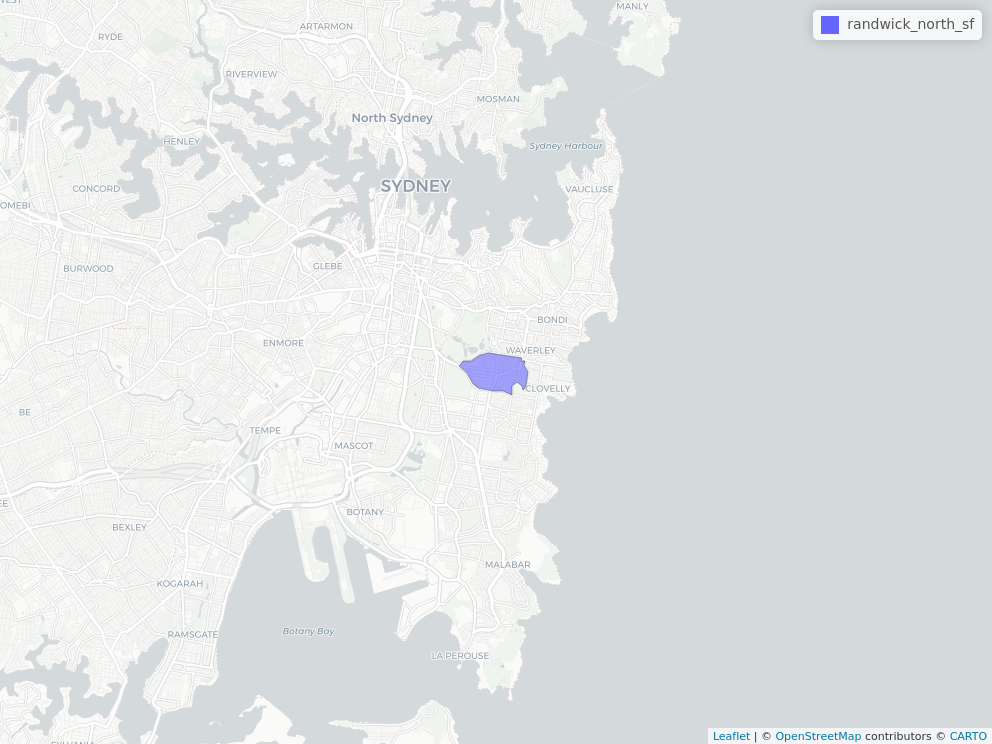

## Prepare microdata/seed population

> **Microdata** is data in a unit record file that provides detailed information about people, households, businesses or other types of records - Source: 1406.0.55.003 - Responsible Use of ABS Microdata, User Guide (https://www.abs.gov.au/ausstats/abs@.nsf/mf/1406.0.55.003)

1. Go to https://www.abs.gov.au/websitedbs/D3310114.nsf/home/MicrodataDownload
2. Click on the 'Log in' button just to the right of the sidebar, as shown in the screenshot below.

    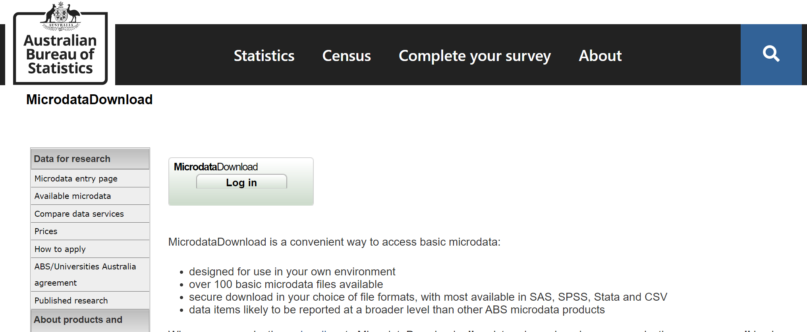

3. Once you have successfully log in, find the entry with the title 'Census of Population and Household, 2016' and proceed to download the CSV version of the microdata. In the picture below, it is the yellow button of the first row.

    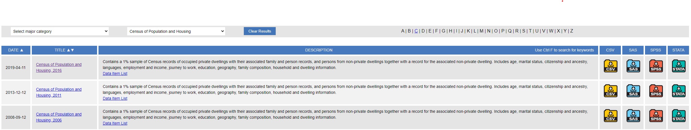

4. Save the file in a location you can easily find, or better yet, in your Rproj folder, then extract the file. The folder should contain 3 files.

    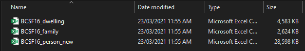

## Prepare control tables


> **Control total** is data in a tabulated format.

ABS provides several datasets through their data portals, one of which is the [ABS Census TableBuilder](https://auth.censusdata.abs.gov.au/webapi/jsf/login.xhtml). TableBuilder is a web interface that allows users to create cross-tabulations of census survey data in different aggregations, across different geographical boundaries, and categories. Check with your university librarian to see if your university is subscribed to this service.

Here are the steps to create and download a control total table from TableBuilder:

1. Go to https://auth.censusdata.abs.gov.au/webapi/jsf/login.xhtml and log in with a valid credential.

    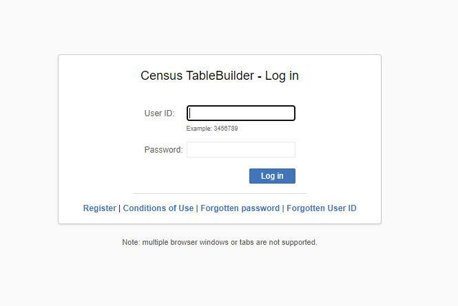

2. Read the conditions of use and click 'Accept conditions of use' if you agree.
3. Navigate to 'Catalogue' -> '2016 Census of Population and Housing' -> 'Census TableBuilder Pro'.

    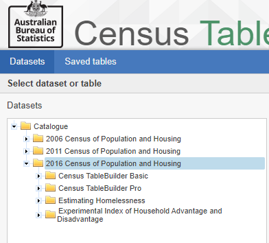

4. Create the person control totals using 2016 Census data. Double-click '2016 Census - Counting Persons, Place of Usual Residence (MB)'.
5. On the side bar menu we need to first select the geographical area that we will create a population for. Open (do not click on the tick mark of the entry) 'Geographical Area (Usual Residence)' -> 'Geographical Areas from Mesh Block (MBs)' -> 'MB by Main Statistical Area Structure (MAIN ASGS) (UR)' -> 'New South Wales' -> 'Sydney - Eastern Suburbs' -> 'Eastern Suburbs - South' -> 'Randwick North'. Tick the box of 'Randwick North' and add to the table as a 'Wafer'.

    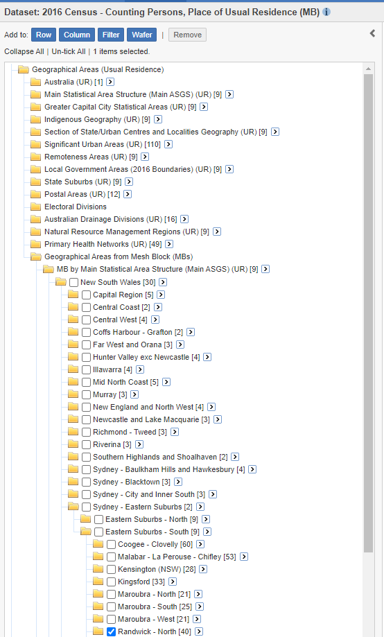

6. Click on the 'c' button in grey color on the same line as 'x SA2 (UR)', once clicked it will turn blue and the area name will be replaced with its area code. This is important for the population synthesiser to sample records from microdata that matches the area code of the control total we are about to create in this step.  
7. Use the sidebar to select all entries under 'SEXP sex'. Navigate to 'Selected Person Characteristic' -> 'SEXP Sex' -> and tick both 'Male' and 'Female' entries. Then add to the table as rows by clicking the 'Row' button.
8. Do the same for 'MSTP marital status'. Make sure to tick on all the categories and add as rows. If you have done everything correctly up to this point your table should look like the one below.

    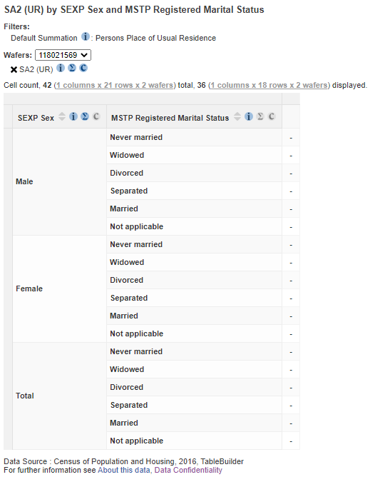

9. Look on the top right of the screen and select 'CSV String Value' from the 'Download Table' drop down option, then click 'Go' to download the table as a CSV file.

    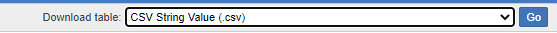

10. Remove both 'SEXP' and 'MSTP' from the table by dragging their headers into the 'Trash' icon.

    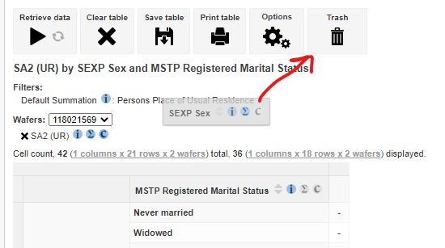

11. Create another table with only 'Occp Occupation' on it. Navigate to 'Employment, Income and Unpaid Work' -> 'OCCP Occupation' and select all the 11 entries in the first level and add to the table as rows and download it.

    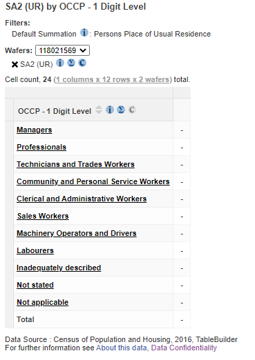

12. If you reach this point, you should now have two person control tables. Let's proceed to create and download another household control table. Click on 'Datasets' to go back to the main menu to select a new dataset. Select 'Catalogue'-> '2016 Census of Population and Housing' -> 'Census TableBuilder Pro' -> '2016 Census - Counting Dwellings, Place of Enumeration (MB)'.

    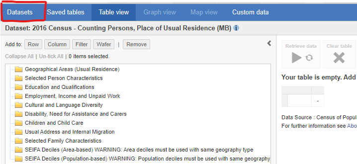

13. Select the same geographical area. Open 'Geographical Area (Enumeration)' -> 'Geographical Areas from Mesh Block (MBs)' -> 'MB by Main Statistical Area Structure (MAIN ASGS) (UR)' -> 'New South Wales' -> 'Sydney - Eastern Suburbs' -> 'Eastern Suburbs - South' -> 'Randwick North'. Tick the box of 'Randwick North' and add to the table as a 'Wafer'. Also make sure that area name is switched to area code by 

    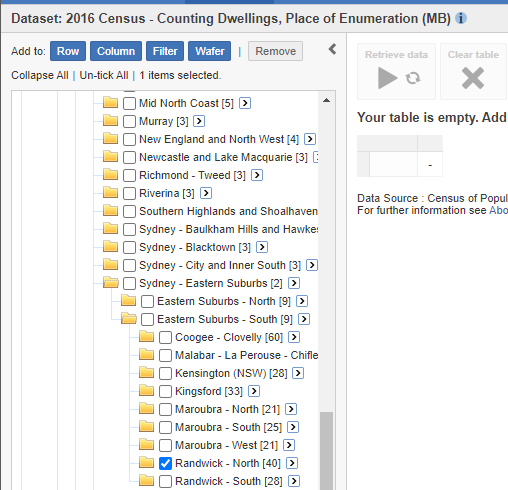

14. 'Selected Dwelling and Household Characteristics' -> 'NPRD Number of Person Usually Resident in Dwelling'. Tick all entires except 'Seven persons' and 'Eight or more persons'. The reason for this is the microdata that we just downloaded doesn't have households that are larger than 6 usual residents to avoid those people from being indentified from their data. There are ways to retify this but it is beyond our goal for this example, which is to provide a simple example.

    

15. Download the table as a 'CSV String Value' file.

## Next step

Now that we have the microdata and control tables, we can proceed to the next step, which is to create a synthetic population. Please proceed to the `vignette("get-started")` vignette.
