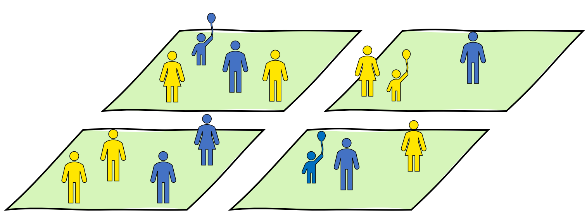
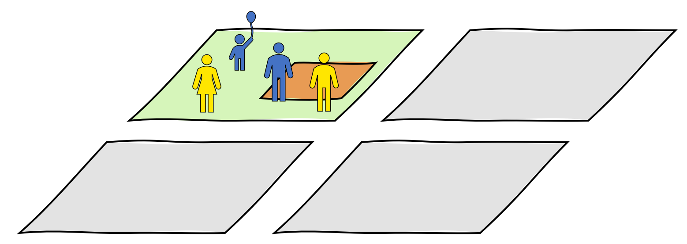

```{r setup, include = FALSE}
knitr::opts_chunk$set(
  collapse = TRUE,
  comment = "#>"
)

knitr::opts_knit$set(root.dir = here::here())
library(PopulationSynthesiser)
```

In this article, we're going to show you how to pre-process your microdata and control tables using the {PopulationSynthesiser} package, then use the `mlfit` package generate synthetic population data.
We'll use the Australian Census 2016 data as an example. 
After we have generated the synthetic population, we'll use the `postfit_*` functions to convert the synthetic population into a format that can be used by [ActivityGenerator](https://aurin-office.github.io/RCITI_ActivityGenerator/).
We refer to this format the 'CVISTA' format, which stands for 'Close-enough to VISTA'.

## Before we get started!

In the following example, we will be using a few other R packages wasn't shipped with your R program, they provide useful functions for transforming and visualising data. So make sure you have installed all these following packages using `install.packages("<packge-name>")`.

- `dplyr` for summarising data in a data.frame.
- `sf` for working with spatial data.
- `mapview` for plotting spatial data.

and of course we will need this package, `PopulationSynthesiser` as well. However, installing this is a bit different as the package is not yet officially on CRAN. Please follow the 'Installation' section on the README page to install the package. 


## Loading the datasets into R

We should now have 2 person control tables, 1 household control table, and 1 microdata. Let's import all of them into R. We can use these functions to read them into R. Notice that, in `read_census_microdata()` you have to state the `census_year` of your microdata and the names of the columns that you would like to select in `select`. `census_year` helps the package to correctly identify the geographical boundary variables in the microdata. `select` is optional, but when stated it can help to reduce the time it takes to import the microdata.

``` r
library(PopulationSynthesiser)
microdata <-
  read_census_microdata(
    person_file = "datasets/Census2016_CSV/BCSF16_person_new.csv",
    family_file = "datasets/Census2016_CSV/BCSF16_family.csv",
    dwelling_file = "datasets/Census2016_CSV/BCSF16_dwelling.csv",
    census_year = "2016",
    select = c("regucp", "agep", "mstp", "sexp", "nprd", "occp", "rlhp")
  ) %>%
  create_fitting_sample()

person_control_1 <-
  read_census_tablebuilder("datasets/person_control_1.csv") %>%
  create_fitting_control()

person_control_2 <-
  read_census_tablebuilder("datasets/person_control_2.csv") %>%
  create_fitting_control()

household_control_1 <-
  read_census_tablebuilder("datasets/household_control_1.csv") %>%
  create_fitting_control()
```

```{r, include = FALSE, eval = FALSE}
library(PopulationSynthesiser)
microdata <-
  read_census_microdata(
    person_file = "inst/testdata/confidential/Census2016_CSV/BCSF16_person_new.csv",
    family_file = "inst/testdata/confidential/Census2016_CSV/BCSF16_family.csv",
    dwelling_file = "inst/testdata/confidential/Census2016_CSV/BCSF16_dwelling.csv",
    census_year = "2016",
    select = c("regucp", "agep", "mstp", "sexp", "nprd", "occp", "rlhp")
  ) %>%
  create_fitting_sample()

person_control_1 <-
  read_census_tablebuilder("inst/testdata/2016-nsw-sa2-ur-sex-mstp.csv") %>%
  create_fitting_control()

person_control_2 <-
  read_census_tablebuilder("inst/testdata/2016-nsw-sa2-ur-occp.csv") %>%
  create_fitting_control()

household_control_1 <-
  read_census_tablebuilder("inst/testdata/2016-nsw-sa2-dwelling-nprd.csv") %>%
  create_fitting_control()
```

```{r, eval = FALSE, include = FALSE} 
randwick_north_sa2_code_2016 <- "118021569"
person_control_1 <- person_control_1[sa2 == randwick_north_sa2_code_2016]
person_control_2 <- person_control_2[sa2 == randwick_north_sa2_code_2016]
household_control_1 <- household_control_1[sa2 == randwick_north_sa2_code_2016]
```

Here are the datasets that we have just loaded into R. Note that, we are not printing out the microdata as is because no ABS microdata should never be shared in its raw form^[https://www.abs.gov.au/ausstats/abs@.nsf/Lookup/by%20Subject/1406.0.55.003~User%20Guide~Main%20Features~Using%20microdata%20responsibly~25].

```r
library(dplyr)

microdata %>%
  dplyr::mutate_if(is.character, as.factor) %>%
  summary()

#>      abshid          absfid           abspid                agep       
#>  Min.   :    1   Min.   :     1   Min.   :     1   30-34 years: 16781  
#>  1st Qu.:23964   1st Qu.: 25630   1st Qu.: 58881   25-29 years: 16488  
#>  Median :47087   Median : 50352   Median :117651   40-44 years: 15868  
#>  Mean   :47324   Mean   : 50629   Mean   :117686   45-49 years: 15692  
#>  3rd Qu.:70473   3rd Qu.: 75529   3rd Qu.:176656   35-39 years: 15378  
#>  Max.   :94988   Max.   :101523   Max.   :235408   50-54 years: 15173  
#>                                                    (Other)    :136873  
#>              mstp                                           occp       
#>  Divorced      :16489   Not applicable                        :125813  
#>  Married       :91167   Professionals                         : 23665  
#>  Never married :65731   Clerical and Administrative Workers   : 14522  
#>  Not applicable:43016   Technicians and Trades Workers        : 14461  
#>  Separated     : 6170   Managers                              : 13754  
#>  Widowed       : 9680   Community and Personal Service Workers: 11651  
#>                         (Other)                               : 28387  
#>      regucp                            rlhp           sexp       
#>  Min.   : 1.00   Husband, Wife or Partner:97510   Female:118040  
#>  1st Qu.:14.00   Child under 15          :40180   Male  :114213  
#>  Median :27.00   Non-family member       :27629                  
#>  Mean   :27.38   Lone person             :20387                  
#>  3rd Qu.:41.00   Non-dependent child     :13171                  
#>  Max.   :57.00   Dependent student       :10794                  
#>                  (Other)                 :22582                  
#>              nprd      
#>  Five persons  :27253  
#>  Four persons  :51121  
#>  Not applicable:20266  
#>  One person    :21789  
#>  Six persons   :17280  
#>  Three persons :39003  
#>  Two persons   :55541

head(person_control_1)
#>          sa2 sexp           mstp count
#> 1: 118021569 Male  Never married  3243
#> 2: 118021569 Male        Widowed   125
#> 3: 118021569 Male       Divorced   431
#> 4: 118021569 Male      Separated   159
#> 5: 118021569 Male        Married  2671
#> 6: 118021569 Male Not applicable  1337
head(person_control_2)
#>          sa2                                   occp count
#> 1: 118021569                               Managers  1618
#> 2: 118021569                          Professionals  3740
#> 3: 118021569         Technicians and Trades Workers   850
#> 4: 118021569 Community and Personal Service Workers   858
#> 5: 118021569    Clerical and Administrative Workers  1184
#> 6: 118021569                          Sales Workers   656
head(household_control_1)
#>          sa2          nprd count
#> 1: 118021569    One person  1861
#> 2: 118021569   Two persons  2538
#> 3: 118021569 Three persons  1139
#> 4: 118021569  Four persons   879
#> 5: 118021569  Five persons   252
#> 6: 118021569   Six persons    48
```

## Synthesise the population

We are now going to create fitting problems, one for each zone. This will help us to sample only the records in the microdata that geographically match our control totals' zones. 

For example, if our microdata contains people from four different zones as shown in the image below. 



But our fitting problem is only for a zone (the orange patch) in one of those regions. In this case, each fitting problem will only sample people from the region that contains the zone to be in the reference sample of the fitting problem.



```r
library(mlfit)

geo_hierarchy <- csf_geo2016()

head(geo_hierarchy)
#>    regucp       sa2
#> 1:      1 101021007
#> 2:      1 101021008
#> 3:      1 101021009
#> 4:      1 101021010
#> 5:      1 101021011
#> 6:      1 101021012

fitting_problems <- ml_problem(
  ref_sample = microdata,
  field_names = special_field_names(
    groupId = "abshid", individualId = "abspid", count = "count",
    zone = "sa2", region = "regucp"
  ),
  group_controls = list(household_control_1),
  individual_controls = list(person_control_1, person_control_2),
  geo_hierarchy = geo_hierarchy
)
#> Creating a list of fitting problems by zone

ml_problem <- fitting_problems[["118021569"]] %>%
  prefit_csf_agep_to_age5p()
```

To solve our fitting problem we can use `ml_fit()` from the `mlfit` package. This package provides 4 different multi-level fitting algorithms: `r paste(PopulationSynthesiser:::.fitting_algorithms, collapse = ", ")`. See `?mlfit::ml_fit` to learn more about the algorithms. Here we are going to use the famous Iterative Proportion Updating algorithm (`ipu`) to solve our fitting problem.

Although, the algorithm did not reach a convergence for this fitting problem, but the errors are quite small. Priting out `fitting_result` to console provides some useful results of your fitting problem.

```r
fitting_result <- mlfit::ml_fit(algorithm = "ipu", ml_problem)
fitting_result
#> An object of class ml_fit
#>   Algorithm: ipu
#>   Success: FALSE
#>   Residuals (absolute): min = -0.02301994, max = 2.829837
#>   Flat problem:
#>   An object of class flat_ml_fit_problem
#>     Dimensions: 30 groups, 1192 target values
#>     Model matrix type: separate
#>     Original fitting problem:
#>     An object of class ml_problem
#>       Reference sample: 2639 observations
#>       Control totals: 2 at individual, and 1 at group level
#>       Zone: 118021569
```

Now let's replicate each record in the reference sample by its fitted/calibrated weights. You can use `mlfit::ml_replicate()` to do that. Lookup `?mlfit::ml_replicate` to see the definitions of its arguments.

```r
full_population <-
  ml_replicate(fitting_result, algorithm = "trs")

full_population %>% 
  dplyr::mutate_if(is.character, as.factor) %>%
  summary()
#>      abshid         absfid           abspid               agep     
#>  Min.   :   1   Min.   :  1008   Min.   :    1   35-39 years:1945  
#>  1st Qu.:1974   1st Qu.: 17458   1st Qu.: 4218   25-29 years:1693  
#>  Median :3502   Median : 17734   Median : 8436   30-34 years:1393  
#>  Mean   :3756   Mean   : 18132   Mean   : 8436   40-44 years:1191  
#>  3rd Qu.:5568   3rd Qu.: 18090   3rd Qu.:12653   55-59 years:1189  
#>  Max.   :7788   Max.   :100648   Max.   :16870   45-49 years:1184  
#>                                                  (Other)    :8275  
#>              mstp                                          occp     
#>  Divorced      :1061   Not applicable                        :7273  
#>  Married       :5314   Professionals                         :3730  
#>  Never married :6853   Managers                              :1622  
#>  Not applicable:2670   Clerical and Administrative Workers   :1184  
#>  Separated     : 359   Community and Personal Service Workers: 856  
#>  Widowed       : 613   Technicians and Trades Workers        : 852  
#>                        (Other)                               :1353  
#>      regucp                         rlhp          sexp     
#>  Min.   :10   Husband, Wife or Partner:5898   Female:8886  
#>  1st Qu.:10   Non-family member       :4450   Male  :7984  
#>  Median :10   Lone person             :1848                
#>  Mean   :10   Child under 15          :1243                
#>  3rd Qu.:10   Non-dependent child     : 949                
#>  Max.   :10   Not applicable          : 738                
#>               (Other)                 :1744                
#>              nprd              age5p     
#>  Five persons  :1126   35-39 years:1945  
#>  Four persons  :2692   25-29 years:1693  
#>  Not applicable:3452   20-24 years:1571  
#>  One person    :2034   30-34 years:1393  
#>  Six persons   : 266   40-44 years:1191  
#>  Three persons :2767   55-59 years:1189  
#>  Two persons   :4533   (Other)    :7888

nrow(full_population)
#> [1] 16870

sum(person_control_1$count)
#> [1] 16866
```

Our fitting problem only has 2639 rows in its reference sample. But once we replicate them, we will have 16870 rows which should closely matched our control totals, as shown by the output of `dim(full_population)`.

## Post processing

```r
full_population %>%
  postfit_add_relationships() %>% # add ids of their partner, father, and mother to each individual
  postfit_integerise_age5p() %>% # turn five-year age groups into single year
  .[, .SD, .SDcols = patterns("_id$|^age$")] %>%
  # select only rows that have a partner, father, or mother using data.table syntax not equal to NA
  .[!is.na(partner_id) | !is.na(father_id) | !is.na(mother_id)] 
#> ℹ Checking inputs
#> ℹ Creating relationship id fields: `partner_id`, `father_id`, `mother_id`
#> ℹ Joining all members with other members (including self) in the same family household
#> ℹ Adding relationships
#> ℹ Cleaning up
#> ✔ Done
#>       partner_id father_id mother_id age
#>    1:        284        NA        NA  53
#>    2:        283        NA        NA  46
#>    3:         NA       283       284  15
#>    4:         NA       283       284  12
#>    5:         NA       283       284  12
#>   ---                                   
#> 7937:         NA        NA     16524   4
#> 7938:         NA        NA     16527   4
#> 7939:         NA        NA     16530   3
#> 7940:         NA        NA     16533   2
#> 7941:         NA        NA     16536   0
```
